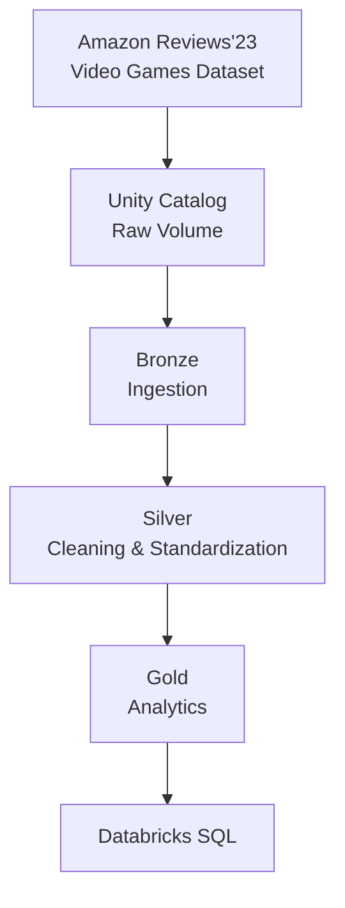

# Amazon Reviews Lakehouse

An end-to-end Lakehouse pipeline on **Databricks Free Edition** using **PySpark**, **Delta Lake**, **Unity Catalog**, and the **Medallion Architecture** — processing Amazon Reviews'23 data through Bronze, Silver, and Gold layers for analytics in Databricks SQL.

---

## Project Overview

This project processes the **Video Games** domain from the Amazon Reviews'23 dataset. Raw review records and product metadata are ingested into Delta tables, cleaned and standardized, then shaped into analytical datasets — all within Databricks using PySpark and Spark SQL.

---

## Architecture



Gold layer will be documented as it is built.

---

## Unity Catalog Structure

```text
amazon_lakehouse/
│
├── raw
│   └── Volumes
│       └── amazon_files/
│           ├── reviews/
│           │   └── Video_Games.jsonl.gz
│           └── metadata/
│               └── meta_Video_Games.jsonl.gz
│
├── bronze/
│   ├── reviews                  (Delta)
│   └── product_metadata_raw     (Delta)
│
├── silver/
│   ├── reviews                  (Delta)
│   ├── review_images             (Delta)
│   ├── products                  (Delta)
│   ├── product_images            (Delta)
│   ├── product_videos            (Delta)
│   └── product_details           (Delta)
│
└── gold/
```

Raw `.gz` files live in Unity Catalog Volumes — Databricks' managed storage. No external cloud setup (S3, GCS) needed.

---

## Repository Structure

```text
amazon-reviews-lakehouse/
├── README.md
├── .gitignore
│
├── bronze/
│   ├── 01_bronze_ingestion
│   └── README.md
│
├── silver/
│   ├── 02_silver_reviews.py
│   ├── 03_silver_products.py
│   └── README.md
│
├── gold/
│   ├── 04_gold_analytics
│   └── README.md
│
└── quality/
    ├── 05_data_quality
    └── README.md
```

---

## Project Workflow

```
1. Download dataset from Amazon Reviews'23
2. Upload to Unity Catalog Volume
3. Bronze — ingest raw data into Delta tables
4. Silver — clean, normalize, and validate
5. Gold — build analytical datasets
6. Analytics — query and dashboard in Databricks SQL
```

---

## Dataset

**Amazon Reviews'23** ([source](https://amazon-reviews-2023.github.io/)), Video Games domain.

- `Video_Games.jsonl.gz` — ratings, text, timestamps, users, helpful votes, verified purchase, nested `images`
- `meta_Video_Games.jsonl.gz` — titles, categories, descriptions, prices, stores, and a flexible `details` object with product-specific nested attributes

---

## Dataset Citation

```bibtex
@article{hou2024bridging,
  title={Bridging Language and Items for Retrieval and Recommendation},
  author={Hou, Yupeng and Li, Jiacheng and He, Zhankui and Yan, An and Chen, Xiusi and McAuley, Julian},
  journal={arXiv preprint arXiv:2403.03952},
  year={2024}
}
```

---

## About

**Biswajit Nahak**

- [GitHub](https://github.com/Biswajitnahak2003)
- [LinkedIn](https://www.linkedin.com/in/biswajit-nahak/)
