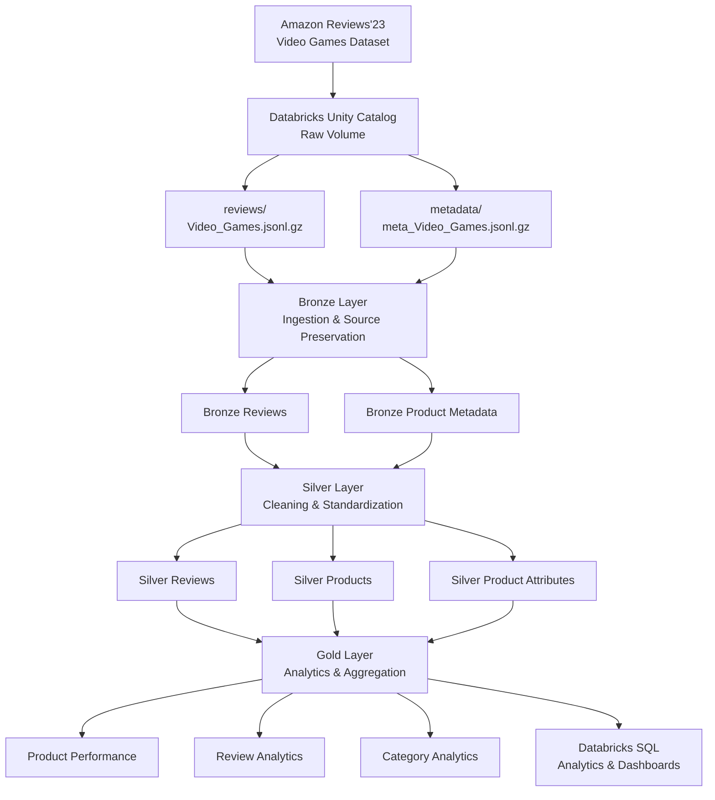

# Amazon Reviews Lakehouse

A Lakehouse pipeline built with **Databricks Free Edition**, **PySpark**, **Spark SQL**, **Delta Lake**, and **Unity Catalog**, and **Medallion Architecture**.

---

## Project Overview

The project processes the **Video Games** domain from the Amazon Reviews'23 dataset. It uses review records and product metadata as the primary data sources, with the raw files retained in the Databricks Unity Catalog Volume.

The data is processed through **Bronze, Silver, and Gold** layers, with transformations performed using PySpark and Spark SQL. The resulting Delta tables are intended for analytical workloads through Databricks SQL.

---
## Architecture

The project follows the **Medallion Architecture**.


---

## Unity Catalog Structure

The project uses the following Unity Catalog:

```text
amazon_lakehouse
```

The catalog contains separate schemas for the different stages of the Lakehouse:

```text
amazon_lakehouse
│
├── raw
│   └── Volumes
│       └── amazon_files
│
├── bronze
│
├── silver
│
└── gold
```

The raw source files are stored in:

```text
/Volumes/amazon_lakehouse/raw/amazon_files/
```

The current raw file structure is:

```text
amazon_files/
│
├── reviews/
│   └── Video_Games.jsonl.gz
│
└── metadata/
    └── meta_Video_Games.jsonl.gz
```

The raw dataset is intentionally **not stored in this GitHub repository**.

---

## Repository Structure

```text
amazon-reviews-lakehouse/
│
├── README.md
├── .gitignore
│
└── notebooks/
    │
    ├── 00_data_profiling
    ├── 01_bronze_ingestion
    ├── 02_silver_reviews
    ├── 03_silver_products
    ├── 04_gold_analytics
    └── 05_data_quality
```

Notebooks will be added and updated as each stage of the pipeline is implemented.

---

## Technology Stack

| Component | Technology |
|---|---|
| Data Platform | Databricks Free Edition |
| Lakehouse | Databricks Lakehouse |
| Catalog | Unity Catalog |
| Storage | Unity Catalog Volumes |
| Processing | Apache Spark / PySpark |
| Querying | Spark SQL |
| Table Format | Delta Lake |
| Source Format | JSONL / GZIP |
| Architecture | Medallion Architecture |
| Version Control | Git / GitHub |
| Analytics | Spark SQL |
| Programming Language | Python |

---

## Dataset

This project uses the **Amazon Reviews'23** dataset developed by researchers at the University of California, San Diego.

The Amazon Reviews'23 dataset contains review interactions and item metadata across multiple Amazon product categories.

This project focuses specifically on the **Video Games** domain.

### Dataset Files

#### Review Dataset

```text
Video_Games.jsonl.gz
```

Contains customer review information, including ratings, review text, timestamps, users, helpful votes, and purchase verification.

#### Product Metadata Dataset

```text
meta_Video_Games.jsonl.gz
```

Contains product information including titles, categories, descriptions, images, stores, prices, and product-specific attributes.

### Official Dataset

[Amazon Reviews'23](https://amazon-reviews-2023.github.io/)

---

## Dataset Characteristics

The dataset was selected because it contains both relatively structured and genuinely semi-structured data.

### Review Data

Review records contain fields such as:

```text
asin
helpful_vote
images
parent_asin
rating
text
timestamp
title
user_id
verified_purchase
```

The `images` field contains nested image information.

A simplified representation is:

```text
review
│
├── asin
├── parent_asin
├── rating
├── title
├── text
├── timestamp
├── user_id
├── verified_purchase
├── helpful_vote
│
└── images[]
      ├── attachment_type
      ├── large_image_url
      ├── medium_image_url
      └── small_image_url
```

---

### Product Metadata

Product metadata contains fields such as:

```text
main_category
title
average_rating
rating_number
features
description
price
images
videos
store
categories
details
parent_asin
bought_together
```

A simplified representation is:

```text
product
│
├── main_category
├── title
├── average_rating
├── rating_number
├── features[]
├── description[]
├── price
├── images[]
├── videos[]
├── store
├── categories[]
├── details{}
├── parent_asin
└── bought_together
```

---

## Semi-Structured Metadata

One of the most interesting parts of the dataset is the `details` field.

Unlike a traditional relational table where every record has the same columns, product metadata can contain different attributes for different products.

For example:

```json
{
  "details": {
    "Pricing": "The strikethrough price is the List Price.",
    "Package Dimensions": "7.5 x 5.5 x 0.6 inches; 4.8 Ounces",
    "Type of item": "CD-ROM",
    "Rated": "Everyone",
    "Item Weight": "4.8 ounces",
    "Manufacturer": "Aerosoft N.A. LTD",
    "Date First Available": "October 2, 2001"
  }
}
```

Another product can contain additional attributes:

```json
{
  "details": {
    "Best Sellers Rank": {
      "Video Games": 137612,
      "PC-compatible Games": 6707
    },
    "Pricing": "The strikethrough price is the List Price.",
    "Package Dimensions": "5.6 x 4.9 x 0.9 inches; 6.4 Ounces",
    "Type of item": "CD-ROM",
    "Rated": "Mature",
    "Manufacturer": "Sierra"
  }
}
```

This means the `details` structure can contain:

- Different keys for different products.
- Different value types.
- Nested objects.
- Product-specific attributes.

This makes the metadata useful for demonstrating real-world **semi-structured data ingestion and transformation**.

---

## Initial Data Profiling

The first notebook is:

```text
notebooks/00_data_profiling
```

The purpose of this notebook is to understand the source data before implementing the Bronze ingestion pipeline.

Initial observations:

- Review JSONL data can be loaded using Spark.
- Review records contain nested image structures.
- Product metadata contains multiple nested structures.
- Product metadata contains a flexible `details` object.
- Different products can contain different attributes inside `details`.
- Spark's default schema resolution encounters a duplicate-field issue while resolving the metadata schema.
- The raw source files remain unchanged in the Databricks Volume.

The metadata schema issue will be handled during Bronze ingestion rather than modifying the original source files.

---

## Data Engineering Challenges

The project intentionally includes several challenges that are common in real-world data engineering systems.

### 1. Semi-Structured Data

The source data is JSONL rather than a clean relational dataset.

### 2. Nested Structures

Reviews and product metadata contain arrays and nested objects.

### 3. Dynamic Product Attributes

The `details` field does not have a single fixed schema across all products.

### 4. Schema Resolution

Spark's schema inference can encounter conflicting field names while processing the metadata.

### 5. Large Files

The source files are large enough to make inefficient processing noticeable.

### 6. Data Quality

The pipeline will need to handle null values, duplicates, inconsistent types, and other quality issues.

### 7. Data Modeling

Review and product information need to be modeled so that they can be efficiently queried together.

---

## Project Workflow

The intended pipeline is:

```text
1. Download source dataset
        |
        v
2. Upload source files to Databricks Volume
        |
        v
3. Profile source data
        |
        v
4. Bronze ingestion
        |
        v
5. Silver cleaning & transformation
        |
        v
6. Gold analytical datasets
        |
        v
7. Databricks SQL queries
        |
        v
8. Analytics dashboard
```

---

## Project Status

### Phase 1 — Environment Setup

- [x] Create Databricks Free Edition workspace
- [x] Create Unity Catalog
- [x] Create `amazon_lakehouse` catalog
- [x] Create `raw` schema
- [x] Create `bronze` schema
- [x] Create `silver` schema
- [x] Create `gold` schema
- [x] Create Unity Catalog Volume
- [x] Create raw data directories
- [x] Download Amazon Reviews'23 Video Games dataset
- [x] Upload review dataset
- [x] Upload metadata dataset
- [x] Create GitHub repository
- [x] Connect GitHub with Databricks
- [x] Create Databricks Git folder

### Phase 2 — Data Profiling

- [x] Load review dataset
- [x] Inspect review schema
- [x] Inspect review records
- [x] Load product metadata
- [x] Inspect product metadata records
- [x] Identify nested structures
- [x] Identify flexible product attributes
- [x] Identify metadata schema-resolution issue

### Phase 3 — Bronze Layer

- [ ] Design Bronze ingestion strategy
- [ ] Ingest review data
- [ ] Ingest product metadata
- [ ] Preserve semi-structured metadata
- [ ] Add ingestion metadata
- [ ] Write Bronze Delta tables
- [ ] Validate Bronze tables

### Phase 4 — Silver Layer

- [ ] Clean review data
- [ ] Standardize timestamps
- [ ] Handle null values
- [ ] Handle duplicates
- [ ] Standardize column names
- [ ] Transform product metadata
- [ ] Normalize product attributes
- [ ] Create Silver review table
- [ ] Create Silver product table
- [ ] Create Silver product attributes table
- [ ] Add data quality checks

### Phase 5 — Gold Layer

- [ ] Design analytical data model
- [ ] Build product performance dataset
- [ ] Build review analytics dataset
- [ ] Build category analytics dataset
- [ ] Create Gold Delta tables
- [ ] Validate Gold datasets

### Phase 6 — Analytics

- [ ] Query Gold tables using Spark SQL
- [ ] Create analytical views where appropriate
- [ ] Build Databricks SQL dashboard
- [ ] Document analytical findings

---

## Future Improvements

Potential future improvements include:

- Incremental ingestion.
- Incremental Silver and Gold processing.
- Pipeline orchestration.
- Automated data quality checks.
- Pipeline monitoring.
- Delta Lake optimization.
- Schema evolution handling.
- Additional analytical datasets.
- Databricks SQL dashboards.
- CI/CD for notebooks and pipeline code.

---

## Why This Project?

The goal of this project is not simply to demonstrate how to read a JSON file with Spark.

It is designed to demonstrate practical data engineering concepts including:

- Lakehouse architecture.
- Medallion architecture.
- Semi-structured data ingestion.
- Apache Spark.
- PySpark.
- Spark SQL.
- Delta Lake.
- Unity Catalog.
- Schema inference and schema challenges.
- Data quality.
- Data transformation.
- Data modeling.
- Analytical data products.
- Git-based development.
- Databricks SQL.

The project intentionally preserves the complexity of the original dataset so that the pipeline demonstrates how a data engineer deals with real-world data rather than only perfectly structured sample data.

---

## Dataset Citation

If you use the Amazon Reviews'23 dataset, please cite the original work.

### Paper

Yupeng Hou, Jiacheng Li, Zhankui He, An Yan, Xiusi Chen, and Julian McAuley.

**Bridging Language and Items for Retrieval and Recommendation.**

arXiv preprint arXiv:2403.03952, 2024.

### BibTeX

```bibtex
@article{hou2024bridging,
  title={Bridging Language and Items for Retrieval and Recommendation},
  author={Hou, Yupeng and Li, Jiacheng and He, Zhankui and Yan, An and Chen, Xiusi and McAuley, Julian},
  journal={arXiv preprint arXiv:2403.03952},
  year={2024}
}
```

### Dataset Source

Amazon Reviews'23 dataset: [amazon-reviews-2023](https://amazon-reviews-2023.github.io/)

---

## Data Storage Policy

The original Amazon dataset is **not included in this GitHub repository**.

The files are stored in the Databricks Unity Catalog Volume:

```text
/Volumes/amazon_lakehouse/raw/amazon_files/
```

This repository contains:

- Source notebooks.
- Project documentation.
- Data engineering code.
- Configuration files.

It does not contain the large raw dataset files.

---

## About me..

**Biswajit Nahak**

B.Tech — Electronics & Telecommunication Engineering

- GitHub: [Biswajitnahak2003](https://github.com/Biswajitnahak2003)
- LinkedIn: [Biswajit Nahak](https://www.linkedin.com/in/biswajit-nahak/)