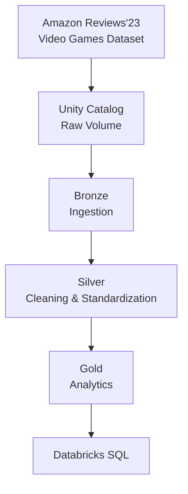

# Amazon Reviews Lakehouse

An end-to-end Lakehouse pipeline built on **Databricks Free Edition**, **PySpark**, **Spark SQL**, **Delta Lake**, **Unity Catalog**, and the **Medallion Architecture**.

---

## Project Overview

Processes the **Video Games** domain from the **Amazon Reviews'23** dataset. Review records and product metadata flow through **Bronze → Silver → Gold** layers using PySpark and Spark SQL, producing Delta tables for analytics in Databricks SQL. Raw files are stored in a Unity Catalog Volume.

---

## Architecture



---

## Unity Catalog Structure

```text
amazon_lakehouse/
│
├── raw
│   └── Volumes
│       └── amazon_files
│
├── bronze
│
├── silver
│
└── gold
```

Raw source files live at `/Volumes/amazon_lakehouse/raw/amazon_files/` and are **not** stored in this repo.

---

## Repository Structure

```text
amazon-reviews-lakehouse/
├── README.md
├── .gitignore
└── notebooks/
    ├── 00_data_profiling
    ├── 01_bronze_ingestion
    ├── 02_silver_reviews
    ├── 03_silver_products
    ├── 04_gold_analytics
    └── 05_data_quality
```

---

## Technology Stack

| Component | Technology |
|---|---|
| Data Platform | Databricks Free Edition |
| Catalog / Storage | Unity Catalog + Volumes |
| Processing | Apache Spark / PySpark |
| Querying | Spark SQL |
| Table Format | Delta Lake |
| Source Format | JSONL / GZIP |
| Architecture | Medallion |
| Language | Python |

---

## Dataset

**Amazon Reviews'23** ([source](https://amazon-reviews-2023.github.io/)), restricted to the **Video Games** domain.

- `reviews/Video_Games.jsonl.gz` — ratings, text, timestamps, users, helpful votes, verified purchase, nested `images`
- `metadata/meta_Video_Games.jsonl.gz` — titles, categories, descriptions, prices, stores, and a flexible `details` object with product-specific, nested attributes

The semi-structured `details` field is a key challenge: keys, value types, and nesting vary per product.

---

## Project Workflow

```text
1. Download dataset
2. Upload to Databricks Volume
3. Profile source data
4. Bronze ingestion
5. Silver cleaning & transformation
6. Gold analytical datasets
7. Databricks SQL queries
8. Analytics dashboard
```

---

## Project Status

- **Phase 1 — Environment Setup** ✅ Catalog, schemas, volume, dataset upload, GitHub sync
- **Phase 2 — Data Profiling** ✅ Schema inspected, nested structures identified, metadata schema issue found
- **Phase 3 — Bronze Layer** ⏳ Ingest reviews + metadata, preserve `details`, write Delta tables
- **Phase 4 — Silver Layer** ⏳ Clean reviews, normalize timestamps/columns, transform product attributes, DQ checks
- **Phase 5 — Gold Layer** ⏳ Product performance, review & category analytics
- **Phase 6 — Analytics** ⏳ Spark SQL queries, views, Databricks SQL dashboard

---

## Dataset Citation

```bibtex
@article{hou2024bridging,
  title={Bridging Language and Items for Retrieval and Recommendation},
  author={Hou, Yupeng and Li, Jiacheng and He, Zhankui and Yan, An and Chen, Xiusi and McAuley, Julian},
  journal={arXiv preprint arXiv:2403.03952},
  year={2024}
}
```

---

## About

**Biswajit Nahak** 

- [GitHub](https://github.com/Biswajitnahak2003)
- [LinkedIn](https://www.linkedin.com/in/biswajit-nahak/)
